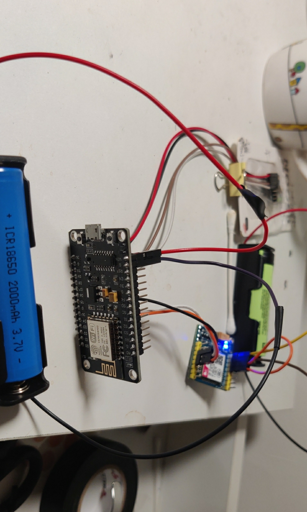

# A series of blog about how to auto carp fishing

https://tuohuang.info/auto-fishing-part1.html, https://tuohuang.info/auto-fishing-part2.html, https://tuohuang.info/auto-fishing-part3.html

## CORE TRIGGERING DEVICE

### SIM800C

> MCU  SIM800C

> RX(D3) - TX  

> TX(D2) - RX

> GND <-> GND

SIM800C's `VBAT` to 3.7v battery's positive, `GND` to 3.7 batter negative.

e.g: s = softuart.setup(9600, 2, 3)
software UART with baudrate of 9600, D2 as Tx pin and D3 as Rx pin

NOTE: need extra separate power supply (e.g 18650 3.7V) to support peak current(2A according to datasheet)

反

Test: sending http get request every 20 seconds, half charged battery last like almost 2 days.

### MPU6050

// Select SDA and SCL pins for I2C communication

const uint8_t scl = D7;
const uint8_t sda = D6;

Wire.begin(sda, scl);

> sda = D6

> scl = D7

e.g: speed = i2c.setup(id, sda, scl, i2c.SLOW) 
e.g  Wire.begin(sda, scl);

> MCU   MPU6050

> SDA <-> SDA

> SCL <-> SCL 

> 3V  <-> vcc

> GND <-> GND

正

Note: no extra power source needed

## BATTERY TO MCU

3.7v 18650 for battery: 

> MCU <-> BATTERY

> VIN(5v) - POS

> GND  - NEG

ensure that not using vcc as it is designed for voltage that not higher than 3.3v(battery provide 3.7v), which doesn't provide sufficient current for board and external sensors. (Input vs Board voltage)

More reference: 

    https://techexplorations.com/guides/esp32/begin/power/

   

