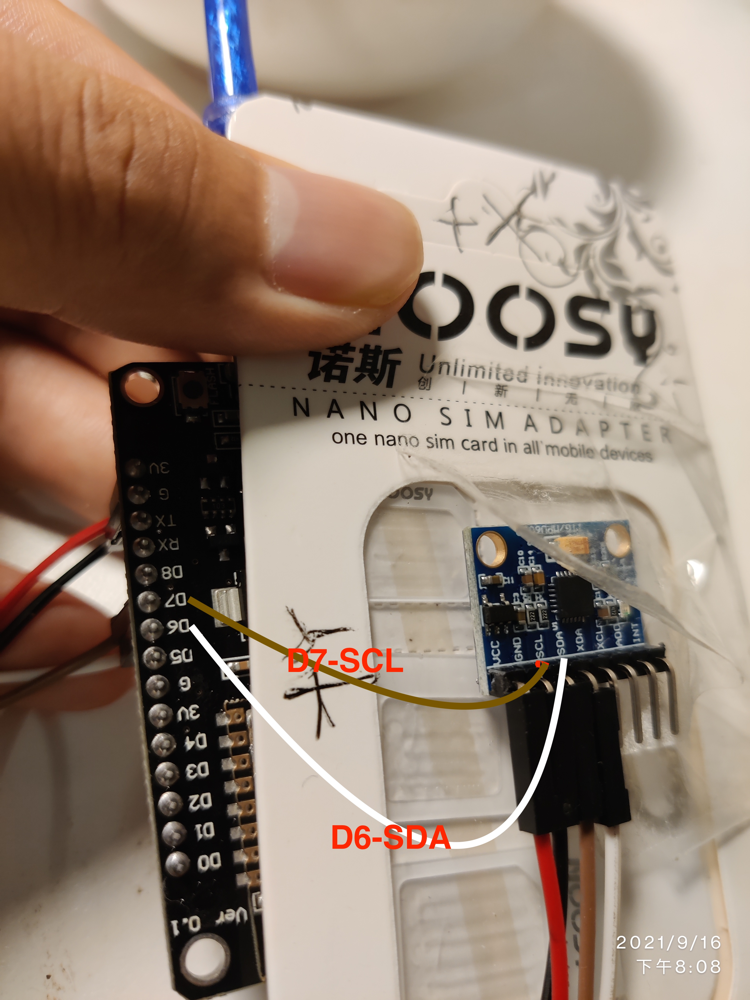

### SIM800C

> MCU  SIM800C

> RX - TX  

> TX - RX

> GND <-> GND

SIM800C's `VBAT` to 3.7v battery's positive, `GND` to 3.7 batter negative.

NOTE: need extra separate power supply (e.g 18650 3.7V) to support peak current(2A according to datasheet)

反

Test: sending http get request every 20 seconds, half charged battery last like almost 2 days.

### MPU6050

> sda = D6

> scl = D7

e.g: speed = i2c.setup(id, sda, scl, i2c.SLOW) 

> MCU   MPU6050

> SDA <-> SDA

> SCL <-> SCL 

> 3V  <-> vcc

> GND <-> GND

正

Note: no extra power source needed

