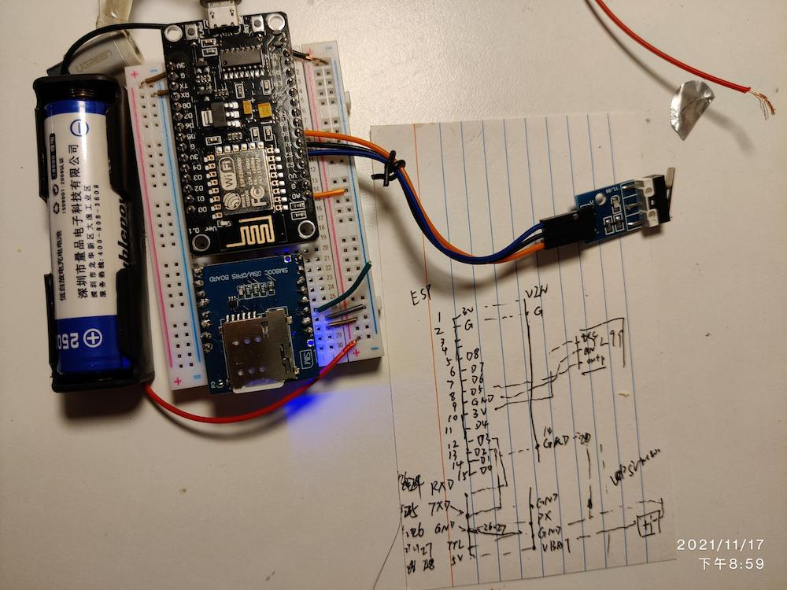
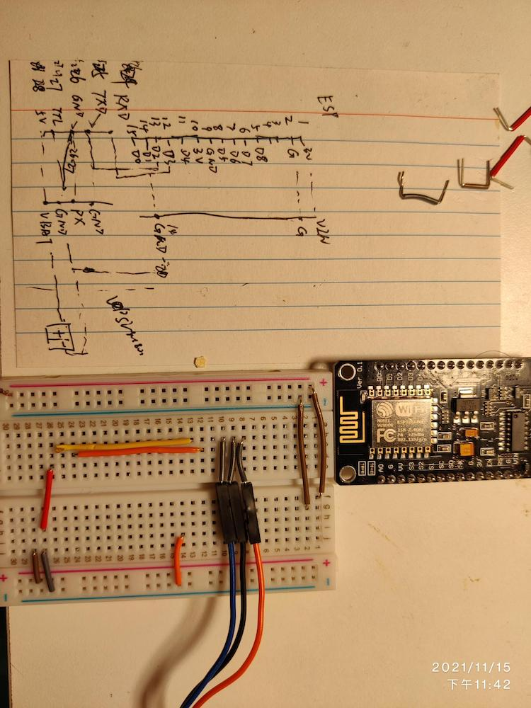

### SIM800C

> MCU  SIM800C

> RX(D3) - TX  

> TX(D2) - RX

> GND <-> GND

SIM800C's `VBAT` to 3.7v battery's positive, `GND` to 3.7 batter negative.

e.g: s = softuart.setup(9600, 2, 3)
software UART with baudrate of 9600, D2 as Tx pin and D3 as Rx pin

NOTE: need extra separate power supply (e.g 18650 3.7V) to support peak current(2A according to datasheet)

反

Test: sending http get request every 20 seconds, half charged battery last like almost 2 days.

### YL-99 collision switch

    

    

sim800l start with row 21 on breadboard
esp8266 - stat with row 1 

both are left most

###